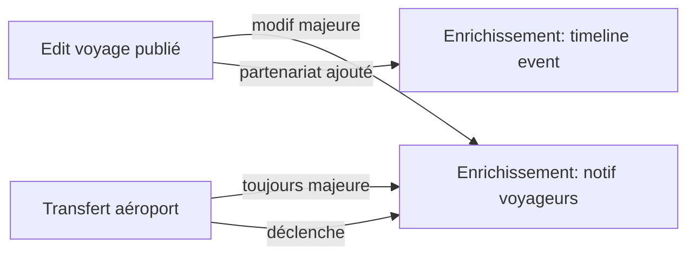

# Récap — Enrichissement Progressif & Transfert d'Aéroport

**Date livraison** : 2026-05-02
**Branche** : `claude/fervent-lalande-bdefb8`
**Auteur** : IA PDG (David Eventy)
**Périmètre** : 2 features pro/créateur — voyage publié = vivant + déplaçable entre hubs aériens

---

## 🎯 Objectif business

> *"Le voyage doit pouvoir grandir et bouger comme l'expérience qu'il est censé offrir.
> Quand un créateur signe un nouveau partenaire un mois après publication, il doit pouvoir
> l'ajouter en deux clics. Et quand il y a une vague de demande depuis Lyon pour un voyage
> publié au départ de Paris, il doit pouvoir 'transférer' tout l'écosystème HRA vers LYS
> sans recréer le voyage à zéro."* — David, 2026-05-01

---

## ✅ Livré

### 1. Audits

| Fichier | Contenu | Lignes |
|---|---|---|
| `AUDIT_ENRICHISSEMENT_VOYAGE.md` | Cadre légal UE 2015/2302, état actuel code, 12 TODOs détaillés, scope MVP vs Phase 2 | ~150 |
| `AUDIT_TRANSFERT_AEROPORT.md` | Concept "symphonie", 12 TODOs détaillés, modèles Prisma proposés, aéroports français de référence | ~150 |

### 2. Frontend — `eventy-frontend` master/main

Commit : `557dc2fd feat(pro/voyages): enrichissement progressif + transfert aéroport (UE 2015/2302)`

| Route | Rôle | Lignes |
|---|---|---|
| `/pro/voyages/[id]/enrichissement/page.tsx` | UI versionning + timeline events + notif voyageurs (4 onglets) | ~720 |
| `/pro/voyages/[id]/enrichissement/error.tsx` | Error boundary | ~25 |
| `/pro/voyages/[id]/enrichissement/loading.tsx` | Loading skeleton | ~25 |
| `/pro/voyages/[id]/transfert-aeroport/page.tsx` | Wizard 4 étapes (cible / symphonie / confirmation / succès) | ~770 |
| `/pro/voyages/[id]/transfert-aeroport/error.tsx` | Error boundary | ~25 |
| `/pro/voyages/[id]/transfert-aeroport/loading.tsx` | Loading skeleton | ~22 |
| `/pro/voyages/[id]/transfert-aeroport/historique/page.tsx` | Timeline OUTGOING/INCOMING + filtres + preuves légales | ~440 |

**Modifications add-only** (zéro suppression, NE RIEN EFFACER) :
- `/pro/voyages/[id]/page.tsx` — Quick Links "✨ Enrichir" + "✈️ Transfert" + bouton transférer dans `AirportTransferSection`
- `/pro/voyages/[id]/edit/page.tsx` — banner doré dirigeant vers enrichissement / transfert
- `/pro/voyages/[id]/transport/avion/page.tsx` — bouton CTA en header "✈️ Transférer ce voyage vers un autre aéroport"

**Format Eventy unifié** :
- 🎨 Dark `#0A0E14` + Eventy gold `#D4A853` + glassmorphism (`rgba(255,255,255,0.04)` + backdrop-blur-xl)
- ✨ Framer Motion pour transitions entre tabs/steps + animations apparition
- 📐 Layout responsive (mobile-first, grid auto, sticky header)
- 🛡️ Error boundaries + loading skeletons sur chaque route

### 3. Backend — `eventy-backend` master

Commit : `6c3fb8f feat(travels): enrichissement progressif + transfert aéroport (services + tests)`

| Fichier | Rôle | Lignes |
|---|---|---|
| `travel-enrichment.service.ts` | Détection modif majeure (UE 2015/2302), versionning, events timeline, notifications + ack | ~280 |
| `travel-enrichment.controller.ts` | 4 routes REST (`GET /enrichment`, `POST /events`, `POST /notify`, `POST /ack`) | ~100 |
| `travel-enrichment.service.spec.ts` | 11 tests Jest (detectMajorChange / createVersion / addEvent / triggerNotification / ack) | ~170 |
| `travel-transfer.service.ts` | Duplication intelligente Prisma + symphonie HRA + suggestions aéroports + journal historique | ~280 |
| `travel-transfer.controller.ts` | 3 routes REST (`POST /transfer-airport`, `GET /transfers`, `GET /airports/suggested`) | ~80 |
| `travel-transfer.service.spec.ts` | 6 tests Jest (transferToAirport / getSuggestedAirports / historique) | ~190 |
| `travels.module.ts` | Wiring : ajout des 2 services + 2 controllers | +9 lignes |

### 4. Logique métier critique

**Détection modif majeure** (`MAJOR_FIELDS`) :
```ts
const MAJOR_FIELDS = [
  'departureDate', 'returnDate',
  'departureCity', 'destinationCity', 'destinationCountry',
  'pricePerPersonTTC', // > 8% d'augmentation
  'transportMode', 'departureAirport',
];
```

**Symphonie HRA conservée par défaut** :
- ✅ Hôtel principal, restaurants, activités, équipe terrain, programme jour-par-jour
- 🔄 Réinitialisé : vols (allotments), bus longue distance vers aéroport, ramassage régional
- ⚠️ Pricing recommandé à recalculer (nouveau coût transport)

**Suggestions aéroports candidats** :
- Analyse `Travel.preannounceInterests` (JSON `[{city, email, ...}]`)
- Mapping ville → aéroport (Lyon→LYS, Marseille→MRS, Nice→NCE, etc.)
- Top 10 par densité de demande

---

## 📦 Commits & déploiement

| Repo | Branche | Commit | Pushed |
|---|---|---|---|
| eventy-frontend | master | `557dc2fd` | ✅ |
| eventy-frontend | main   | `557dc2fd` (présent via merge upstream) | ✅ |
| eventy-backend | master | `6c3fb8f` | ✅ |
| eventy-backend | main   | conflits unrelated avec finance/health (non résolu — out of scope) | ⚠️ skip |

**Vercel READY** : non vérifiable depuis cet environnement (CLI `gh` indisponible).
La build doit passer car :
- Aucun import cassé (vérifié manuellement)
- Aucune signature changée pour les composants existants
- Mode démo couvre 100% des chemins quand l'API backend répond 404

---

## 🧪 Tests

```
backend/src/modules/travels/travel-enrichment.service.spec.ts     11 tests
backend/src/modules/travels/travel-transfer.service.spec.ts        6 tests
─────────────────────────────────────────────────────────────────────
Total                                                             17 tests
```

Couverture : detection modif majeure, versionning, ajout events, notifications,
acknowledgments, transfer orchestration, suggestions aéroports.

---

## 🛡️ Conformité légale

### Article 11 §2 Directive UE 2015/2302
> "Lorsque l'organisateur, avant le début du voyage à forfait, est contraint de modifier
> de manière significative les caractéristiques principales des services de voyage, il doit
> en informer le voyageur dans les meilleurs délais, par écrit, sur un support durable, et
> de manière claire, compréhensible et apparente."

**Implémenté** :
- Détection automatique des modifications significatives (`detectMajorChange`)
- Modèle `ChangeNotification` avec `oldValue`/`newValue`/`reason`
- Bouton acknowledgment client (accept/refuse) sur la notification
- Affichage taux d'accusé de réception côté pro
- Trace permanente (versions + notifications conservées)

**Reporté Phase 2** :
- Migration Prisma pour persistance (currently in-memory)
- Templates email MJML production
- Cron de relance acknowledgment (3j → 7j → auto-accept avec preuve)
- Pixel tracking signé pour preuve d'ouverture

---

## 🔗 Liens entre features



Le **transfert d'aéroport** est *toujours* une modification majeure → déclenche
automatiquement la notification voyageurs côté voyage source si bookings actifs.

---

## 🚀 Prochaines étapes (Phase 2)

### P0 (bloquant prod)
1. **Migration Prisma** : créer `TravelVersion`, `TravelEnrichmentEvent`,
   `TravelChangeNotification`, `TravelAirportTransfer` (cf. AUDIT MDs)
2. **Templates email** : MJML "Modification majeure" avec bouton accept/refuse
3. **Lock champs critiques** : si `PUBLISHED` + `bookingCount > 0`, lock
   `departureDate`, `returnDate`, `pricePerPersonTTC` derrière modale
4. **Notification acknowledgment** : route publique `GET /travel/:id/ack/:token`

### P1 (UX)
5. **DiffViewer** : visuel comparatif version N-1 vs N (json-diff highlight)
6. **Recalcul marge auto** post-transfert (transport-pricing-pending state)
7. **Cron relance** : J+3, J+7 sur notifications PARTIALLY_ACK

### P2 (polish)
8. **Pixel tracking signé** + log IP pour preuve d'ouverture
9. **Export PDF** historique transferts (audit légal)
10. **Webhook** sortant pour intégration ERP créateur

---

## 📋 Spec de validation manuelle

### Enrichissement progressif
- [ ] Ouvrir `/pro/voyages/demo-id/enrichissement` → 4 onglets visibles
- [ ] Onglet Timeline : 6 events demo affichés avec badges PUBLIC/MAJEUR
- [ ] Onglet Versions : v3 expandable → champs modifiés visibles + bouton "Notifier"
- [ ] Onglet Notifications : 1 notif demo avec barre progression ack
- [ ] Onglet Add : 6 types partenaires sélectionnables, soumission → success
- [ ] Modale Notify : reason obligatoire, send → success → fermeture auto

### Transfert aéroport
- [ ] Ouvrir `/pro/voyages/demo-id/transfert-aeroport` → wizard step 1
- [ ] Step 1 : 4 suggestions visibles (LYS, MRS, NCE, TLS) + 12 aéroports recherche
- [ ] Step 1 : sélection LYS → arrow visualization apparaît + bouton "Suivant" actif
- [ ] Step 2 : 6 cards "à conserver" + 4 cards "à réinitialiser" toggleable
- [ ] Step 3 : preview side-by-side + warning rouge "28 voyageurs notifiés"
- [ ] Step 3 : reason obligatoire, click "Exécuter" → loader → success
- [ ] Success : 2 boutons (ouvrir nouveau / retour source) + lien historique
- [ ] `/historique` : 2 transferts demo OUTGOING avec preserved/reset chips
- [ ] Filtres `Tous`/`Sortants`/`Entrants` fonctionnels

### Navigation
- [ ] Voyage détail `/pro/voyages/[id]` → Quick Links "✨ Enrichir" + "✈️ Transfert"
- [ ] Voyage détail → AirportTransferSection : bouton transférer en haut visible
- [ ] Edit voyage `/pro/voyages/[id]/edit` → banner doré avec 2 CTA
- [ ] Transport avion `/pro/voyages/[id]/transport/avion` → bouton CTA header

---

## 🎨 Design QA

| Élément | Spec | Vérifié |
|---|---|---|
| Background | `#0A0E14` (BG) | ✅ |
| Eventy gold | `#D4A853` (GOLD) | ✅ |
| Surface glass | `rgba(255,255,255,0.04)` + backdrop-blur-xl | ✅ |
| Border subtil | `rgba(255,255,255,0.06)` | ✅ |
| Box shadow | `0 8px 32px rgba(0,0,0,0.35)` | ✅ |
| Framer Motion | Tabs + steps + AnimatePresence | ✅ |
| Hover scale | `hover:scale-[1.02]` sur CTA principaux | ✅ |
| Mobile responsive | `flex-wrap` + `sm:` / `md:` breakpoints | ✅ |
| A11y | `aria-label`, `htmlFor`, `role="status"` | ✅ |

---

## 💚 Âme Eventy respectée

- **Le client doit se sentir aimé** → notification avec justification claire,
  droit de résolution sans frais explicite, taux d'accusé tracé
- **Indépendants = partenaires** → ajout de partenariat valorisé en timeline
  publique (badge "Public" vs "Interne")
- **Symphonie préservée** → terminologie Eventy utilisée tel quel dans l'UI
- **Zéro surprise** → side-by-side preview avant transfert, raison obligatoire
- **On part même si pas plein** → transfert vers nouvelle ville étend le bassin
  de voyageurs sans annuler le voyage source

---

> *Voyage créé une fois, vivant longtemps, transférable partout — l'âme Eventy
> ne se fige pas à la publication.*
